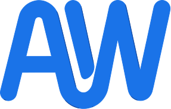

<div align="center">
  
  <h1>✨ IdeaBomb ✨</h1>
  <h3>Think Bigger. Collaborate Smarter.</h3>
  <p>
    An infinite, intelligent collaborative whiteboard powered by <strong>Google Gemini AI</strong>.
  </p>

  <p>
    <a href="https://github.com/AriesHongHuanWu/IdeaBomb/actions">
      
    </a>
    <a href="https://github.com/AriesHongHuanWu/IdeaBomb/blob/main/LICENSE">
      
    </a>
    <a href="https://github.com/AriesHongHuanWu/IdeaBomb/issues">
      
    </a>
    <a href="https://github.com/AriesHongHuanWu/IdeaBomb/graphs/contributors">
      
    </a>
  </p>

  <p>
    <a href="#-features">Features</a> •
    <a href="#-tech-stack">Tech Stack</a> •
    <a href="#-getting-started">Getting Started</a> •
    <a href="#-license">License</a>
  </p>
</div>

<br />

## 🚀 About The Project

**IdeaBomb** is more than just a whiteboard. It's a workspace where engineering teams can brainstorm, plan, and build with the power of infinite space and AI intelligence.

Built with **React**, **Firebase**, and **Gemini AI**, it offers a seamless, real-time collaboration experience that feels premium and responsive.

<div align="center">
  
  
</div>

---

## ✨ Features

<table>
  <tr>
    <td align="center">
      <h3>🤖 AI-Powered</h3>
      <p>Generate plans, summarize notes, and get context-aware suggestions with <strong>Google Gemini</strong>.</p>
    </td>
    <td align="center">
      <h3>⚡ Real-Time</h3>
      <p>Live cursor tracking, instant updates, and seamless multi-user collaboration.</p>
    </td>
  </tr>
  <tr>
    <td align="center">
      <h3>🎨 Infinite Canvas</h3>
      <p>Zoom, pan, and dragging without limits. <strong>Glassmorphism</strong> UI specifically crafted for focus.</p>
    </td>
    <td align="center">
      <h3>🛠 Rich Toolset</h3>
      <p>Stickies, Shapes, YouTube embeds, Timers, Pomodoro, and Kanban boards.</p>
    </td>
  </tr>
</table>

### 💎 Premium Experience
- **Dark Mode**: A carefully crafted Slate-themed dark mode.
- **Micro-interactions**: Smooth Framer Motion animations.
- **Multilingual**: Fully localized for English and Traditional Chinese.

---

## 🛠 Tech Stack

Built with cutting-edge technologies for performance and scalability.

| Category | Technology |
|----------|------------|
| **Core** |   |
| **Styling** |   |
| **Backend** |  (Auth, Firestore, Storage) |
| **AI** |  |
| **Deployment** |  |

---

## ⚡ Getting Started

Clone the project and run it locally in minutes.

### Prerequisites

*   Node.js (v18+)
*   npm or yarn

### Installation

```bash
# 1. Clone the repository
git clone https://github.com/AriesHongHuanWu/IdeaBomb.git

# 2. Enter the directory
cd IdeaBomb

# 3. Install dependencies
npm install

# 4. Environment Setup
cp .env.example .env
# Fill in your Firebase & Gemini API keys in .env

# 5. Start the server
npm run dev
```

---

## 📜 License

Distributed under the MIT License. See `LICENSE` for more information.

---

<div align="center">
  <p>Created by <strong>AWBest Studio</strong></p>
  <p>
    Hosted with 🧡 on <strong>Cloudflare</strong>
  </p>
</div>
